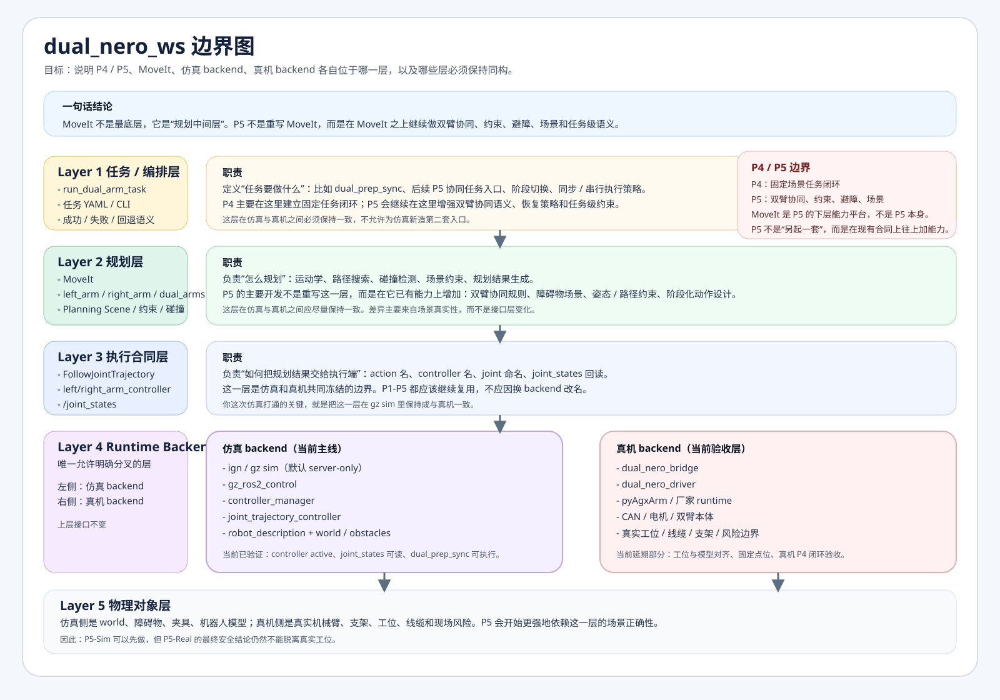

# 当前架构分层

## 作用

说明当前项目哪些层必须在真机与仿真之间保持一致，哪些层允许分叉；同时明确 P4、P5 和 MoveIt 的边界。

## 边界图

图文件已保存到仓库，可直接在 GitHub 中查看：

- [dual_nero_boundary_map.svg](dual_nero_boundary_map.svg)

## 读图要点

### 1. MoveIt 不是最底层

MoveIt 位于“规划中间层”，上面是任务 / 编排层，下面是执行合同层和 runtime backend。

它负责：

- 运动学
- 路径规划
- 碰撞检测
- Planning Scene
- 约束处理

它不负责：

- 任务语义定义
- 双臂同步规则
- 失败恢复策略
- 现场工位真实性

### 2. P5 不是重写 MoveIt

P5 的工作是在现有 MoveIt 基础上继续做：

- 双臂协同规则
- 场景 / 障碍物建模
- 约束与避障
- 多阶段任务设计
- 失败后的任务级恢复

所以，P5 是“在 MoveIt 之上增强任务级能力”，不是再造一套规划器。

### 3. 真机与仿真的分叉点

当前只允许在 runtime backend 分叉：

- 真机：`bridge -> driver -> pyAgxArm -> hardware`
- 仿真：`gz sim -> gz_ros2_control -> controller_manager -> joint_trajectory_controller`

上层必须保持一致：

- 任务入口
- MoveIt group
- controller 命名
- `FollowJointTrajectory`
- `/joint_states`

## 当前阶段口径

- `P4-A 仿真执行链`：已完成
- `P4-B 真机固定场景闭环`：延期，等待工位与模型对齐
- `P5-Sim`：第一版实施完成，收口验收中
- `P5-Real`：最终结论仍依赖真实工位

## 当前冻结原则

- 不允许为了仿真新造第二套任务入口
- 不允许为了仿真改动 joint / group / controller 命名合同
- 不允许把当前 P1-P4 的任务层成果丢掉重来
- 允许只替换最底层执行 backend
