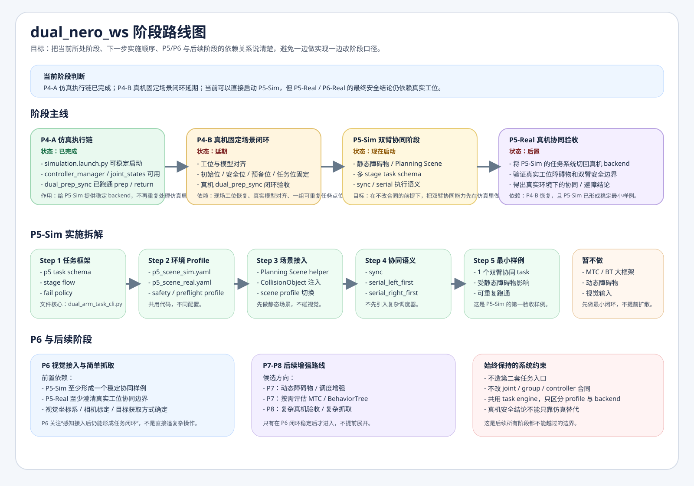

# 总体路线

## 目标

本项目最终目标不是停留在“机械臂能动”，而是让双臂系统能基于当前代码稳定执行真实物理任务，并逐步走到：

- 双臂协调运动
- 避障
- 视觉接入
- 简单抓取

## 当前阶段位置图

图文件入口：

- [phase_delivery_map.svg](phase_delivery_map.svg)

## 当前阶段口径

- `P4-A 仿真执行链`：已完成
- `P4-B 真机固定场景闭环`：延期
- `P5-Sim`：现在启动
- `P5-Real`：后置到真实工位恢复之后
- `P6`：当前先做规划，不立即实现

## 已有基础

- P1：最小真实执行链已通过
- P2：正式入口 preflight 与安全 gate 已通过
- P3-A：故障恢复 SOP 已落地
- P3-B：MoveIt 主路径已验证通过
- P4-A：仿真 backend 已打通，`dual_prep_sync` 已在仿真中跑通

## 路线原则

1. 上层任务系统尽量只写一套，通过 profile + backend 适配仿真和真机
2. 先做最小可重复协同闭环，再做更复杂能力叠加
3. 先做静态场景和固定障碍，再考虑视觉与动态场景
4. 真机安全结论不能只靠仿真替代

## P4：固定场景任务闭环

阶段入口：

- [../phases/p4/README.md](../phases/p4/README.md)

当前拆分：

- `P4-A` 已完成
- `P4-B` 延期，等待工位与模型对齐

## P5：双臂协同、约束、避障

阶段入口：

- [../phases/p5/README.md](../phases/p5/README.md)

当前优先做：

- `P5-Sim`
- 多 stage task schema
- 静态 Planning Scene
- 最小协同执行语义
- 最小失败回退策略

暂不直接展开：

- `P5-Real` 复杂验收
- 动态障碍物
- 复杂框架替换

## P6：视觉接入与简单抓取

阶段入口：

- [../phases/p6/README.md](../phases/p6/README.md)

当前只做规划，不立即展开实现。进入条件取决于：

- `P5-Sim` 已稳定
- `P5-Real` 已形成可信的真实场景结论
- 视觉坐标链路和标定方式明确

## P7：动态场景与调度增强

阶段入口：

- [../phases/p7/README.md](../phases/p7/README.md)

当前先保留为后续增强阶段，主要承接：

- 动态障碍物
- 更复杂调度 / 分支 / 重试
- 如确有必要，再评估 MTC / BehaviorTree

## P8：复杂真机验收与复杂任务闭环

阶段入口：

- [../phases/p8/README.md](../phases/p8/README.md)

当前先保留为更后续的真实交付阶段，主要承接：

- 复杂真机验收
- 复杂抓取与操作链
- 更高强度的真实工位安全结论

## 当前明确不在本轮主线中的内容

- 切换到 native `ros2_control`
- 大规模重写 bridge 架构
- 在 P5 之前引入视觉抓取
- 在 P5 第一版里提前做动态障碍物 / 复杂调度框架
